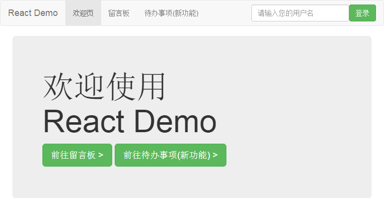

# React 示例项目 · 简易留言板 + 待办事项





## 目录
#### &sect; [技术栈](#features)
#### &sect; [快速开始](#getting-started)
  * [安装](#installation)
  * [启动](#start)

#### &sect; [项目架构](#architecture)
  * [目录结构](#tree)
  * [特色](#character)

#### &sect; [开发](#development)
  * [Webpack 配置](#webpack-configure)
  * [规范](#standard)
  * [性能](#performance)
  
#### &sect; [测试](#testing)  
#### &sect; [部署](#deployment)
#### &sect; [参考](#reference)

****

## <a name="features">&sect; 技术栈</a>
> 详情可参阅 `package.json`

* React 15.3.0
* Redux
* React Router
* Ajax 请求库（Superagent / jQuery-Ajax / ...）
* Webpack
* ES6 + Babel
* jQuery + BootStrap (UI)

***

## <a name="getting-started">&sect; 快速开始</a>
在开始前，希望您已通读如下资料

* [React 文档][react-doc]
* [Redux 文档][redux-doc]（看完后懵逼的请转看 [Redux 莞式教程][simple-tutorial]）
* [React Router 文档][react-router-doc]

同时您还需要熟悉 ES6。例如，请把如下代码  
`const foo = ({ hello: { world: bar } }) => ({ bar })`  
转译成 ES5（答案请自行到 [Babel REPL][babel-repl] 在线编译验证）

### <a name="installation">⊙ 安装</a>
> 推荐升级到 node 5.x/6.x + npm 3.x 环境，**强烈推荐**使用 [`cnpm`](https://github.com/cnpm/cnpm) 安装依赖或手动   
> 切换到淘宝 npm 源：`npm set registry https://registry.npm.taobao.org/`  
> （经测试，`cnpm` 对于 `node-sass` 等问题多多的 Package 拥有秒杀能力）

本示例项目需要结合 [简易留言板 RESTful API](https://github.com/kenberkeley/msg-board-api)  
模拟前后端分离开发（还为了与 [Vue Demo][vue-demo] 共用）  
请分别 `git clone`，打开**两个**命令窗口（ Windows 下推荐使用 `Cygwin / Git Bash`）**分别**切换到两者的目录下  
分别敲下 `npm install` 安装依赖（为避免 Windows 下 npm 2.x 的软链接问题，可加上 `--no-bin-link` 完全解构所有依赖）

### <a name="start">⊙ 启动</a>
先后在 `msg-board-api`、`react-demo` 的命令窗口下，敲下 `npm start`  
如无意外，默认浏览器就会自动打开 `localhost:9090`，您立即可以看到效果  
若浏览器没有自动弹出，则请自行手动访问  

> P.S. 如果您还不清楚如何安装与启动，请看这个 [issue][how-to-start]

***

## <a name="architecture">&sect; 项目架构</a>
### <a name="tree">⊙ 目录结构</a>
```
.
├─ build/            # Webpack 配置目录
├─ dist/             # build 生成的生产环境下的项目
├─ src/              # 源码目录（开发都在这里进行）
│   ├─ assets/         # 放置需要经由 Webpack 处理的静态文件
│   ├─ components/     # 组件（COMPONENT）
│   ├─ redux/          # Redux 一箩筐
│   │   ├─ actions/      # （ACTION）
│   │   ├─ reducers/     # （REDUCER）
│   │   ├─ store/        # （STORE）
│   ├── routes/        # 路由（ROUTE）
│   ├── services/      # 服务（SERVICE，用于统一管理 XHR 请求，这是从 Vue Demo 中直接复制过来的）
│   ├── utils/         # 工具库（UTIL）
│   │   ├─ HoC/          # 高阶组件（HOC，全称 Higher Order Component）
│   │   ├─ mixins/       # 混合（MIXIN）
│   ├── views/         # 路由视图基页（VIEW）
│   │   ├─ layout/       # 全局布局
│   ├── app.js         # 启动文件
│   ├── index.html     # 静态基页
├── static/          # 放置无需经由 Webpack 处理的静态文件
├── .babelrc         # Babel 转码配置
├── .eslintignore    # （配置）ESLint 检查中需忽略的文件（夹）
├── .eslintrc        # ESLint 配置
├── .gitignore       # （配置）需被 Git 忽略的文件（夹）
├── package.json     # （这个就不用多解释了吧）
```
